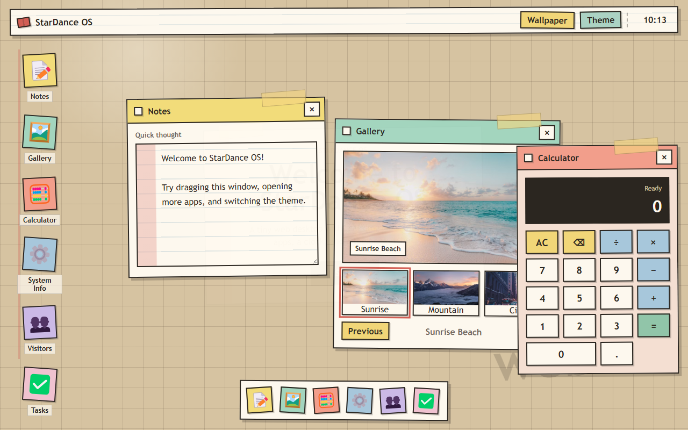
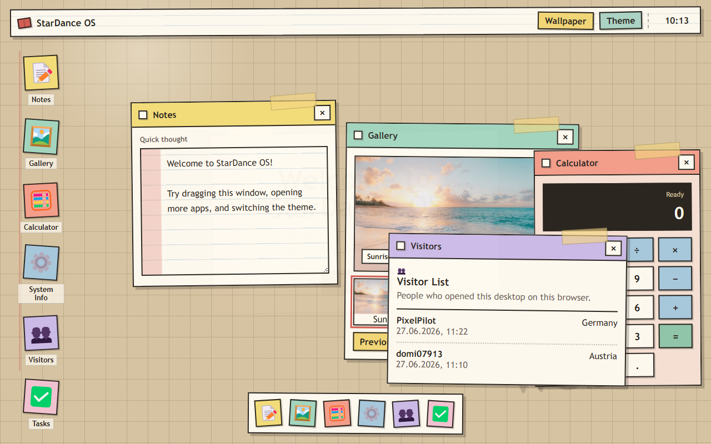
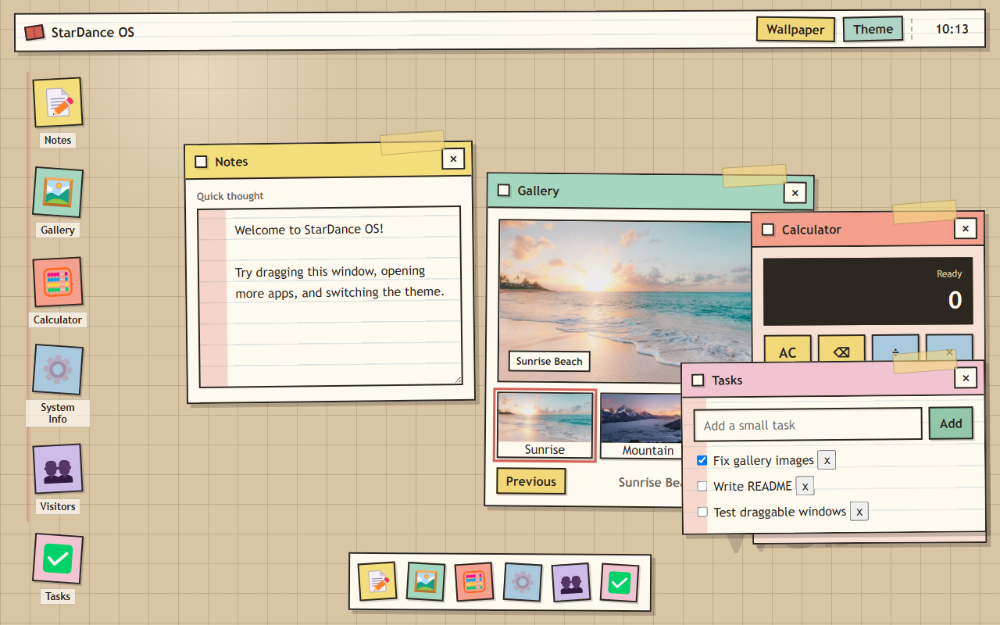

# StarDance OS

StarDance OS is my small WebOS-style desktop made with plain HTML, CSS, and JavaScript. It does not have a password screen, so anyone can open it and test the apps right away.

## What It Does

- Shows a welcome screen before the desktop opens.
- Has a top bar with a live clock, theme button, and wallpaper button.
- Opens multiple draggable windows at the same time.
- Lets windows close, reopen, focus, and snap near the screen edges.
- Includes Notes, Gallery, Calculator, System Info, Visitors, and Tasks apps.
- Saves notes, tasks, theme, wallpaper, and first-visit state in the browser.
- Stores visitor names in JSONBin so the visitor list can be shared.
- Checks suspicious guestbook names and asks for a `confirm` step before saving them.

## Apps

- **Notes:** a simple textarea that saves after refresh.
- **Gallery:** three real image links with thumbnails and previous/next buttons.
- **Calculator:** basic math with button and keyboard input.
- **System Info:** shows simple desktop status.
- **Visitors:** asks first-time visitors for a name or pseudonym and shows the shared guestbook.
- **Tasks:** my extra app for adding, checking off, and deleting small tasks.

## How I Made It

I started with the required OS desktop parts first: welcome screen, desktop icons, top bar, clock, and draggable windows. After that I added one app at a time. The calculator was the hardest because I had to keep track of the expression, display, delete button, and keyboard input.

Later, I changed the design because the first version felt too much like a generic shiny template. The current style is meant to look more like my own messy desk: paper windows, pencil lines, tape pieces, sticker-like app icons, square buttons, and small uneven rotations. I also added wallpaper switching and the Tasks app so there is more to interact with than just opening windows.

The visitor list uses JSONBin. When somebody joins the guestbook, the page saves their name, country, and visit time to the shared JSON record.

## Screenshots

The screenshot files in `docs/screenshots/` are browser captures of the project: the desktop, the visitor list, the gallery, and the new tasks app.

## Run It

Open `index.html` in a browser, or deploy the folder to Vercel.

## Files

- `index.html` has the desktop structure and app windows.
- `style.css` controls the handmade desk/notebook look and responsive layout.
- `script.js` controls the clock, dragging, apps, storage, calculator, gallery, tasks, wallpaper, and visitors.
- `vercel.json` redirects `/README.md` to `/readme.md` and serves the README as raw text.
